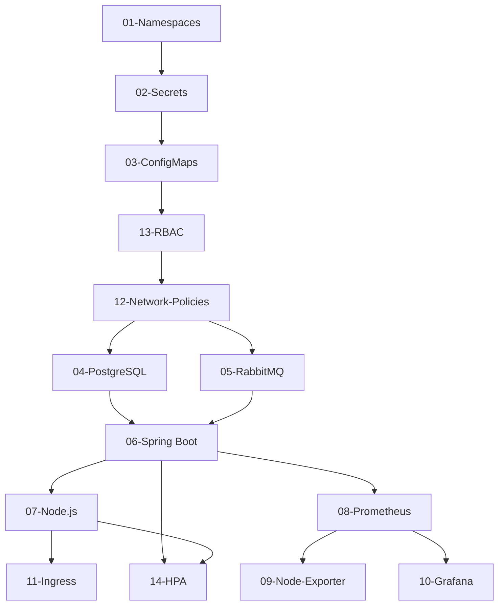

# Base Kubernetes Manifests

## Overview

This directory contains the **base Kubernetes manifests** that serve as the foundation for all environments (dev, staging, production). These manifests define the core infrastructure components without environment-specific customizations.

## Purpose

The base manifests follow the **DRY (Don't Repeat Yourself)** principle and are used with **Kustomize** to generate environment-specific configurations through overlays.

## Directory Structure

```
base/
├── 01-namespaces/          # Namespace definitions
├── 02-secrets/             # Base secret templates
├── 03-configmaps/          # Application configurations
├── 04-postgres/            # PostgreSQL StatefulSet
├── 05-rabbitmq/            # RabbitMQ message broker
├── 06-springboot/          # Spring Boot backend
├── 07-nodejs/              # Node.js frontend
├── 08-prometheus/          # Prometheus monitoring
├── 09-node-exporter/       # Node metrics exporter
├── 10-grafana/             # Grafana dashboards
├── 11-ingress/             # Ingress controller configs
├── 12-network-policies/    # Network security policies
├── 13-rbac/                # Role-Based Access Control
├── 14-hpa/                 # Horizontal Pod Autoscalers
└── kustomization.yaml      # Base kustomization config
```

## Components

### 1. Namespaces (01-namespaces/)
Defines Kubernetes namespaces for logical separation of resources.
- **Files**: `namespace.yaml`
- **Purpose**: Isolate workloads and apply resource quotas

### 2. Secrets (02-secrets/)
Base64 encoded secrets for sensitive data.
- **Files**: `postgres-secret.yaml`, `rabbitmq-secret.yaml`, `grafana-secret.yaml`
- **⚠️ Security**: These are templates. Override with actual secrets per environment

### 3. ConfigMaps (03-configmaps/)
Configuration data for applications.
- **Files**: `springboot-config.yaml`, `prometheus-config.yaml`
- **Purpose**: Externalize configuration from container images

### 4. PostgreSQL (04-postgres/)
Stateful database deployment.
- **Files**: `statefulset.yaml`, `service.yaml`, `pvc.yaml`
- **Type**: StatefulSet with persistent storage
- **Ports**: 5432

### 5. RabbitMQ (05-rabbitmq/)
Message broker for asynchronous communication.
- **Files**: `statefulset.yaml`, `service.yaml`, `pvc.yaml`
- **Type**: StatefulSet
- **Ports**: 5672 (AMQP), 15672 (Management UI)

### 6. Spring Boot Backend (06-springboot/)
Java backend application.
- **Files**: `deployment.yaml`, `service.yaml`
- **Type**: Deployment
- **Ports**: 8080
- **Dependencies**: PostgreSQL, RabbitMQ

### 7. Node.js Frontend (07-nodejs/)
Frontend application.
- **Files**: `deployment.yaml`, `service.yaml`
- **Type**: Deployment
- **Ports**: 3000

### 8. Prometheus (08-prometheus/)
Metrics collection and monitoring.
- **Files**: `deployment.yaml`, `service.yaml`, `configmap.yaml`
- **Type**: Deployment
- **Ports**: 9090

### 9. Node Exporter (09-node-exporter/)
Node-level metrics collection.
- **Files**: `daemonset.yaml`, `service.yaml`
- **Type**: DaemonSet (runs on every node)
- **Ports**: 9100

### 10. Grafana (10-grafana/)
Visualization and dashboarding.
- **Files**: `deployment.yaml`, `service.yaml`
- **Type**: Deployment
- **Ports**: 3000

### 11. Ingress (11-ingress/)
HTTP/HTTPS routing and load balancing.
- **Files**: `ingress.yaml`, `tls-secret.yaml`
- **Purpose**: Expose services externally with TLS termination

### 12. Network Policies (12-network-policies/)
Network segmentation and security.
- **Files**: `default-deny.yaml`, `allow-*.yaml`
- **Purpose**: Implement zero-trust networking

### 13. RBAC (13-rbac/)
Role-Based Access Control.
- **Files**: `roles.yaml`, `rolebindings.yaml`, `serviceaccounts.yaml`
- **Purpose**: Least privilege access control

### 14. HPA (14-hpa/)
Horizontal Pod Autoscalers.
- **Files**: `springboot-hpa.yaml`, `nodejs-hpa.yaml`
- **Purpose**: Automatic scaling based on metrics

## Usage

### Direct Deployment (Not Recommended)
```bash
# Apply all base manifests (development testing only)
kubectl apply -k base/
```

### With Environment Overlays (Recommended)
```bash
# Deploy to specific environment using overlays
kubectl apply -k environments/dev/
kubectl apply -k environments/staging/
kubectl apply -k environments/prod/
```

## Kustomization

The base manifests are designed to be customized using Kustomize. Each environment overlay can:
- Override resource limits
- Change replica counts
- Modify environment variables
- Apply environment-specific patches

## Best Practices

1. **Never modify base directly for environment needs** - Use overlays instead
2. **Keep secrets as templates** - Real secrets go in environment overlays
3. **Use labels consistently** - All resources include `app`, `component`, `version` labels
4. **Resource limits** - Base includes conservative defaults
5. **Health checks** - All deployments have readiness/liveness probes

## Deployment Order



## Environment Customization

See individual environment directories for specific configurations:
- `environments/dev/` - Development environment
- `environments/staging/` - Staging environment
- `environments/prod/` - Production environment

## Maintenance

- **Version Control**: All changes must be committed to Git
- **Testing**: Test changes in dev before promoting
- **Documentation**: Update this README when adding/removing components
- **Security**: Regular security audits of base configurations

## Support

For issues or questions about base manifests, refer to the main repository README or create an issue.
